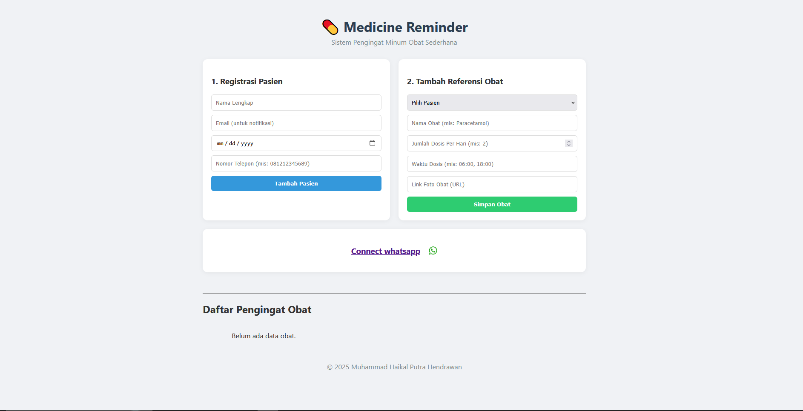

# Aplikasi Medicine Reminder

***
## Tentang Aplikasi
Aplikasi ini dapat memberikan pengingat konsumsi obat secara otomatis, berbasis web dan terintegrasi dengan whatsapp dan email (gmail)


## Instalasi
### konfigurasi awal
1. clone repositori ini ke komputer anda

```
git clone https://github.com/haikalhendrawan/medicine-reminder.git
```
2. Pada direktori dimana anda melakukan command tersebut, akan terbentuk folder baru bernama "medicine-reminder", kemudian lakukan ubah ke direktori tersebut

```
cd ./medicine-reminder
```


3. Setelah anda pastikan bahwa anda telah berada dalam folder project, lakukan install dependensi dengan command berikut

```
npm i
```

4. terakhir, kita perlu mengisi environment variabel berupa kredensial gmail yang akan dihubungkan.
5. Pada folder, buat file baru dengan nama ".env"
6. Untuk mengisi file tersebut, anda perlu mengcopy isi dari file bernama ".env.example"
7. paste pada file .env yang baru dibuat, akan terdapat dua variabel
```
GMAIL_USER = 
GMAIL_PASSWORD = 
```
8. untuk variabel GMAIL_USER isi dengan gmail yang akan anda gunakan utk mengirim email nantinya
9. untuk variabel password, pastikan anda telah login akun google anda pada browser dan navigasi ke halaman berikut https://myaccount.google.com/apppasswords
10. kemudian tambah baru, contoh "aplikasi medicine reminder"
11. akan tampil password berupa 16 huruf. Simpan password tersebut pada file yang aman. Kemudian kita copy dan paste ke variabel GMAIL_PASSWORD pada file .env
```
GMAIL_USER = myemail@gmail.com
GMAIL_PASSWORD = ABCD EFGH IJKL MNOP
```
***
### Menjalankan aplikasi
1. untuk menjalankan aplikasi kita run command berikut

```
npm run dev
```
2. buka browser anda dan navigasi ke http://localhost:3000
3. pastikan pada aplikasi telah muncul

***

### Menghubungkan Whatsapp
1. pada halaman beranda klik tombol connect whatsapp
2. tunggu sesaat sampai QR code muncul
3. pada aplikasi whatsapp di handphone anda, buka pengaturan/settings dan cari menu perangkat terhubung/linked device
4. klik tombol link a device/hubungkan perangkat
5. scan qr code pada aplikasi
6. apabila sukses terhubung, akan tertampil whatsapp authenticated pada aplikasi
7. silahkan kembali ke halaman utama

***

### Menambah Reminder Obat
1. pada halaman utama, tambahkan data pasien melalui form "Registrasi Pasien". Data ini perlu kita input sebagai tujuan dalam mengirim email dan whatsapp
2. isi kelengkapan data nama, email, tanggal lahir, dan nomor handphone (dalam format 0xxxxx)
3. setelah berhasil mendaftarkan pasien, kita dapat menambah referensi obat pada formulir "Tambah Referensi Obat"
4. Pilih pasien yang telah didaftarkan
5. isi nama obat
6. isi jumlah dosis per hari
7. isi waktu reminder akan dikirim dalam format (HH:MM), apabila terdapat lebih dari 1 kali dosis perhari pisahkan dengan tanda koma
8. Contoh: dosis per hari (2 kali sehari) dan waktu minum obat (6 pagi dan 6 sore), maka kita perlu mengisi kolom waktu dosis dengan format berikut "06:00, 18:00" (tanpa tanda " ")
9. isi link foto obat, untuk memudahkan anda dapat mencari foto obat pada google, klik kanan pada gambar yang dipilih dan pilih opsi copy image link. Kemudian paste pada form
10. simpan refensi obat
11. anda cukup bersantai dan tunggu sampai jam yang ditentukan. Akan muncul pesan pada whatsapp dan gmail anda sebagai reminder pengingat obat!
12. untuk mengetes fungsional anda dapat mengisi waktu jam dan menit terdekat.

***
### Troubleshooting
Q: QR code pada aplikasi tidak kunjung muncul

A: hal ini dapat disebabkan autentikasi diputus pada tengah jalan, atau tidak lengkap. Untuk mengatasinya cukup hapus folder .wwebjs_auth pada direktori utama aplikasi dan jalankan kembali aplikasi dengan command 
```
npm run dev
```